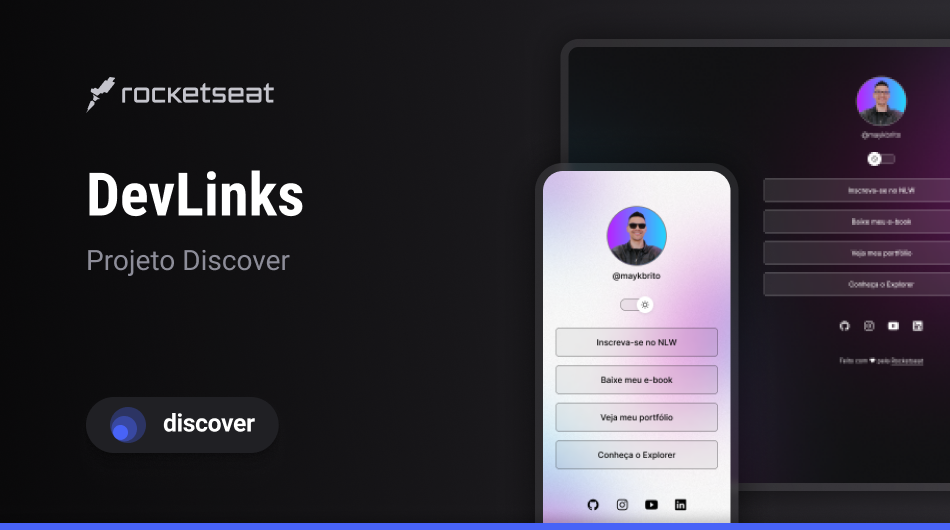

<h1 align="center"> DevLinks </h1>

Projeto desenvolvido no programa Discover da Rocketseat, promovendo ensinos sobre desenvolvimento web básico.

  <a href="#-tecnologias">Tecnologias</a>&nbsp;&nbsp;&nbsp;|&nbsp;&nbsp;&nbsp;
  <a href="#-projeto">Projeto</a>&nbsp;&nbsp;&nbsp;|&nbsp;&nbsp;&nbsp;
  <a href="#-layout">Layout</a>&nbsp;&nbsp;&nbsp;|&nbsp;&nbsp;&nbsp;
  <a href="#-licença">Licença</a>

  

 

  

## Tecnologias

Esse projeto foi desenvolvido com as seguintes tecnologias:

- HTML e CSS
- Javascript
- Git e Github
- Figma

## Projeto

O DevLinks é um agregador de links para usar como cartão de visitas online.

## Layout

Você pode visualizar o layout do projeto através [DESSE LINK](<https://www.figma.com/file/cxjix7yP1CD7RGqVz04uqn/DevLinks-%E2%80%A2-Projeto-Discover-(Community)?node-id=10%3A620&mode=dev>)

## Licença

Esse projeto está sob licença MIT.

---

Feito com ♥ por
<a href="https://linkedin.com/in/thiagofontanella">Thiago Fontanella</a>
